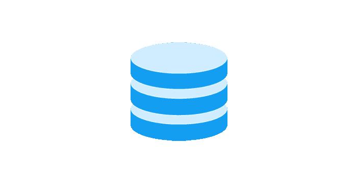
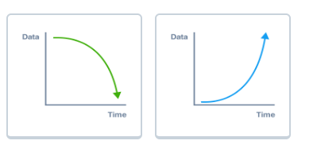
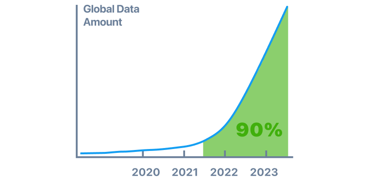
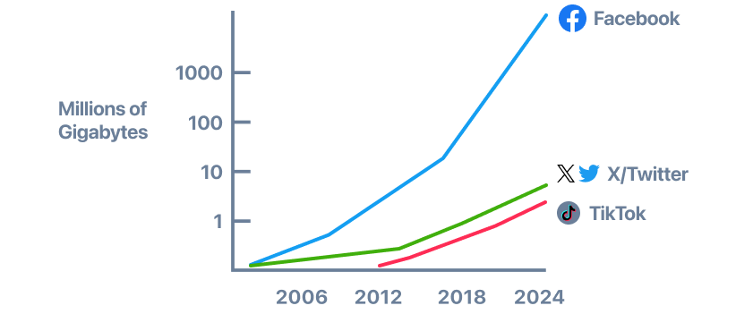
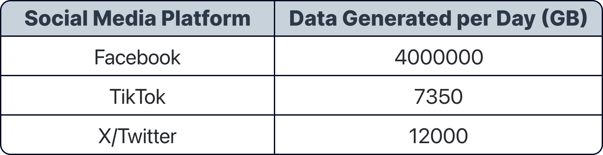

Data analysis and visualization are now used in every industry to find meaningful insights and make important decisions. 

The latest AI tools make it easier to work with data and can help you build data skills faster. Let's see how!

As humans, we are constantly generating data.
Select the visualization that best represents this data trend

We're producing more data than ever before, and we keep generating more every year.
The chart above shows that 90% of the world's data was generated in the last two…

decades
years

AI can help you develop skills to understand data better and get more out of it.
Have questions about the data visualization? 

Explain the visualization

The chart shows the rise in data generated (millions of gigabytes) for Facebook, X/Twitter, and TikTok from 2006 to 2024. Facebook's data generation exceeds 1000 million gigabytes by 2024, with X/Twitter and TikTok both nearing 10 million gigabytes.

Every interaction, transaction, communication, and activity in the digital world generates data. 
Ready to dive deeper? Explore the interactive graphic

True or False?
Customer reviews on Amazon and clicks on Netflix are transformed into data

Translate course
Wow! Just look at how much data each platform generates.

Tables like this one can show a lot of useful data in a structured way
Which social media platform generates the most data?
Facebook generates the most data with 4,000,000 GB per day.

Which option below shows an example of structured data?

GenAI is well known for understanding and producing unstructured data. Now it can also understand and analyze structured data.

Our ability to generate, collect, and analyze tons of data is growing. When data is too large or complex for one device to handle, this is known as Big Data.

## Let's recap!
Data analysis and visualizations are everywhere because data is everywhere. 

No matter what you do, data is involved. And just by being here now, you're already taking a great step to boost your career.