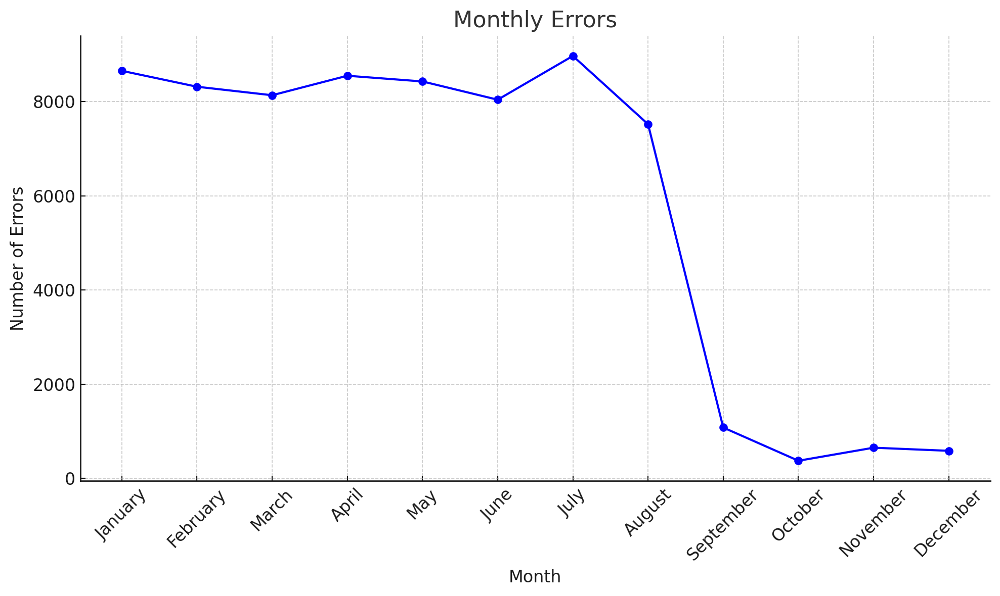

# Data Storytelling

Analysis and visualization help you uncover the story your data is trying to tell you. 

In this lesson, you'll learn to tell data stories that inspire action.

A popular restaurant chain has tracked the number of errors made when preparing orders before and after the introduction of an automated ordering system. You'll work with this dataset to tell a data story.

Translate course
Telling a good story starts with understanding your data better.

AI can help you with this

Describe and summarize the data
This dataset provides information on the number of errors recorded each month in a year, from January to December. The month with the highest number of errors is September with 1079 errors, while the month with the lowest number of errors is October with 374 errors. The number of errors fluctuates throughout the year, with an overall trend of decreasing errors towards the end of the year. The total number of errors summed up over the year is 50,217.

Identifying the problem you want to solve or the question you want to answer is key for your audience.

1. How many errors were made in total before the introduction of the automated ordering system?
2. How many errors were made in total after the introduction of the automated ordering system?
3. In which month was the automated ordering system introduced?
4. How did the introduction of the automated ordering system affect the error trends?
5. Which month had the highest number of errors? Which month had the lowest?
6. What is the average number of errors per month before the introduction of the automated system?
7. What is the average number of errors per month after the introduction of the automated system?
8. How much percentage was the amount of errors reduced after the introduction of automated system?
9. Was there a continuous decrease in errors after introducing the automated system, or were there fluctuations?
10. Were there any specific months where error rates increased after the introduction of the automated system?
11. How did the error rate in December compare to the error rate in January? 
12. Can we attribute the decrease in errors solely to the introduction of the automated system, or were there other potential influencing factors?

Translate course
The same data can be visualized in different ways.

You can use AI to explore different ways to visualize your data

The visualization is telling us that automation was implemented between…

May and June
August and September

Some visualizations are better than others to tell an effective story. When exploring different visualizations ask yourself whether the chart is the correct one to support the story.

AI can help you add annotations, labels, legends and suggest descriptive titles for a chart

Give it a try

Trends in Monthly Errors

AI can also help you with the narrative
Write a short paragraph to explain that the number of order errors were reduced after introducing automation

Introducing automation in August resulted in a notable decrease in order errors. Monthly error counts were high, regularly exceeding 7,500 before the change. Post-automation, there was a clear reduction in errors, with numbers dropping significantly in the ensuing months, and October recording just 374 errors. This highlights the positive impact of automation on reducing operational errors and improving accuracy.

The story you tell about your data will be different for different audiences.

Let's give the prompt below a try

The deployment of automation in August led to a marked reduction in order errors. In the months leading up to this change, error counts were consistently high, with January at 8,656 errors, February at 8,318 errors, and July peaking at 8,972 errors. Following the automation, errors dropped significantly, with August recording 7,522 errors. This positive trend continued, with September showing 1,079 errors, October 374 errors, November 651 errors, and December 585 errors. The data clearly illustrates that automation has significantly improved order accuracy, reducing monthly error counts from over 7,500 to well below 1,000, and thereby significantly enhancing overall operational efficiency.

Numbers alone rarely inspire action. Stories often encounter less resistance and create connections that last.

Keep your visualizations simple and only include the visual elements that give value.

Decorative elements that don't add value to your story make your visuals harder to understand.

Which display elements don't add value to your story?

Select all correct answers.

Let's recap!
Fantastic work! Now you know:

⭐Data storytelling presents findings in an understandable way

⭐Data storytelling influences, convinces and inspires action

⭐You can use AI to craft data stories faster

