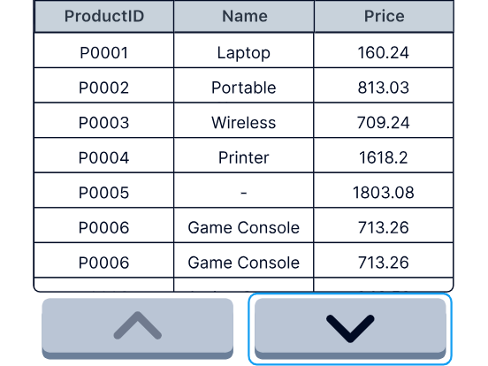
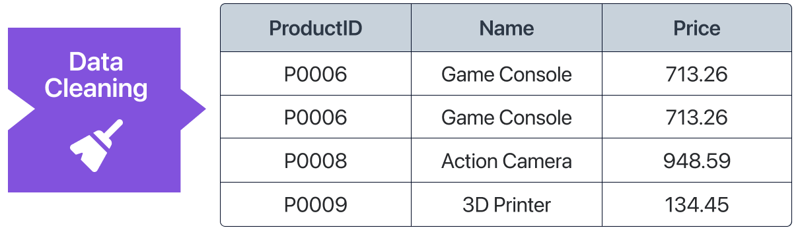
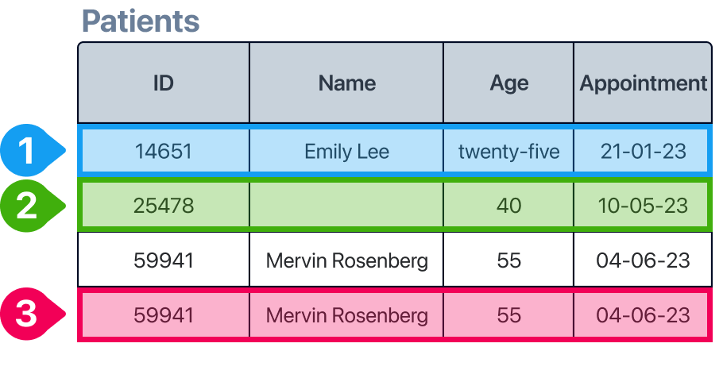
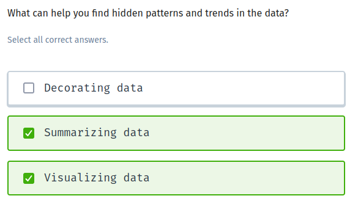

# The Data Analysis Workflow

Content for The Data Analysis Workflow lesson.

Data rarely comes in ready for analysis. Most of the world's data is stored as raw (or unprocessed) data. 

Analyzing data means turning raw data into insights. In this lesson, you'll learn about the steps involved. 

You are a store manager. You think your product catalog needs to be updated.

Which question can help you make a decision?

How long are the orders taking to be delivered?
How many different products are there in the inventory?

In this lesson, you'll work with this store dataset. 

It contains raw data about products and it comes with some data quality issues. 

Data can come from different sources. Internal data is generated inside an organization like employee information. External data is gathered from outside sources like social media, satellites, or government websites. 

If you are a store manager, your store inventory data is…

external data
internal data

Data can come to you with quality issues. Data cleaning is a key step in the data analysis process.

What issue do you see in the image?

Missing values
Duplicated data

Missing data and data duplication are very common data quality issues.

Ask AI if the dataset contains any duplicates or missing values

To identify and remove duplicate records from the dataset, we would look for entries with identical ProductID or completely identical rows. 
The given dataset contains the following duplicate record:

P0006,Game Console,713.26 (This appears three times)

Removing the duplicate entries, we get the updated dataset as follows:
ProductID,Name,Price
P0001,Laptop,160.24
P0002,Portable Charger,813.03
P0003,Wireless Charger,709.24
P0004,Printer,1618.2
P0005,,1803.08
P0006,Game Console,713.26
P0008,Action Camera,948.59
P0009,3D Printer,134.45
P0010,,962.22
P0011,Soundbar,1998.94
P0012,Tablet,one hundred sixty
P0013,3D Printer,1573.67
P0014,Electric Scooter,802.55
P0015,Smart Mirror,925.18
P0016,NAS Device,1496.34
P0017,Air Purifier,761.01
P0018,Smart Light Bulb,1932.45
P0019,Smartwatch,1555.5
P0020,Smart Plug,1395.53
P0021,Video Doorbell,736.23
P0022,Flash Drive,762.16
P0023,Air Purifier,1072.59
P0024,Smart Door Lock,937.76
P0025,Soundbar,1579.63
P0026,VR Headset,1422.41
P0027,Smart Light Bulb,1550.92
P0028,Bluetooth Tracker,1621.31
P0029,WiFi Extender,189.75
P0030,Headphones,506.02
P0031,,486.48
P0032,Smart Plug,403.32
P0033,Fitness Tracker,263.09
P0034,Electric Scooter,1886.49
P0035,Air Purifier,1400.56
P0036,WiFi Extender,648.75
P0037,Electric Toothbrush,1950.84
P0038,Memory Card,1817.46
P0039,Flash Drive,650.09
P0041,Air Purifier,ninety-nine
P0042,Smart Light Bulb,1397.76
P0043,Bluetooth Speaker,1283.38
P0044,Soundbar,1382.61
P0045,Bluetooth Tracker,676.89
P0046,Smart TV,642.12
P0047,NAS Device,1502.79
P0048,Bluetooth Tracker,1188.03
P0049,Digital Camera,1492.21
P0050,Smart Scale,81.2

By removing the duplicate records for "P0006, Game Console, 713.26", we ensure each product is listed once.

Data in the incorrect format can cause issues.

Use AI to detect and fix problems with data types
The Price field contains non-numeric text:
- For ProductID P0012 (Tablet), the price is "one hundred sixty".
- For ProductID P0041 (Air Purifier), the price is "ninety-nine".
To fix these issues, we can convert these textual prices to numeric values.
- ProductID P0012 (Tablet) now has a price of 160.00.
- ProductID P0041 (Air Purifier) now has a price of 99.00.
ProductID,Name,Price
P0001,Laptop,160.24
P0002,Portable Charger,813.03
P0003,Wireless Charger,709.24
P0004,Printer,1618.2
P0005,,1803.08
P0006,Game Console,713.26
P0006,Game Console,713.26
P0008,Action Camera,948.59
P0009,3D Printer,134.45
P0010,,962.22
P0011,Soundbar,1998.94
P0012,Tablet,160.0
P0013,3D Printer,1573.67
P0014,Electric Scooter,802.55
P0015,Smart Mirror,925.18
P0016,NAS Device,1496.34
P0017,Air Purifier,761.01
P0018,Smart Light Bulb,1932.45
P0019,Smartwatch,1555.5
P0020,Smart Plug,1395.53
P0021,Video Doorbell,736.23
P0022,Flash Drive,762.16
P0023,Air Purifier,1072.59
P0024,Smart Door Lock,937.76
P0025,Soundbar,1579.63
P0026,VR Headset,1422.41
P0027,Smart Light Bulb,1550.92
P0028,Bluetooth Tracker,1621.31
P0029,WiFi Extender,189.75
P0030,Headphones,506.02
P0031,,486.48
P0032,Smart Plug,403.32
P0033,Fitness Tracker,263.09
P0034,Electric Scooter,1886.49
P0035,Air Purifier,1400.56
P0036,WiFi Extender,648.75
P0037,Electric Toothbrush,1950.84
P0038,Memory Card,1817.46
P0039,Flash Drive,650.09
P0006,Game Console,713.26
P0041,Air Purifier,99.0
P0042,Smart Light Bulb,1397.76
P0043,Bluetooth Speaker,1283.38
P0044,Soundbar,1382.61
P0045,Bluetooth Tracker,676.89
P0046,Smart TV,642.12
P0047,NAS Device,1502.79
P0048,Bluetooth Tracker,1188.03
P0049,Digital Camera,1492.21
P0050,Smart Scale,81.2

Identify the data quality issues

Identify the data quality issues

1: 
data type
2: 
missing value
3: 
duplication

Extracting insights from cleaned data helps us make data-driven decisions.

What can help you find hidden patterns and trends in the data?

The last step of the data analysis process is communicating your findings. Data visualization and data storytelling will help you turn data insights into actions.

What's your favorite way to communicate findings? Click on the comments to share your thoughts with your fellow learners.

Let's recap!
Fantastic work! Now you know:

⭐The data analysis workflow consist of 5 steps

⭐ AI can help make data cleaning quick and easy

