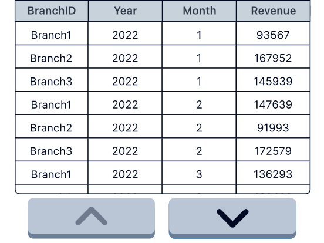
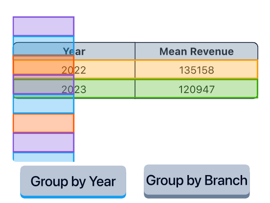
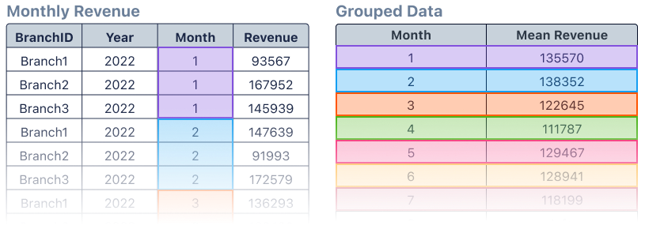
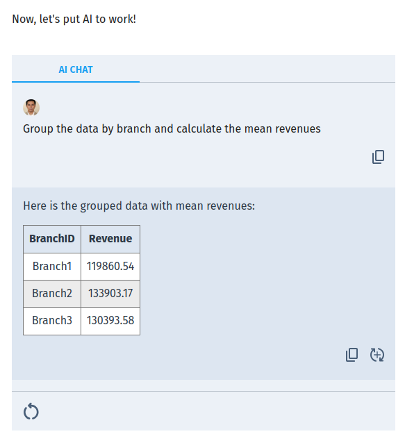
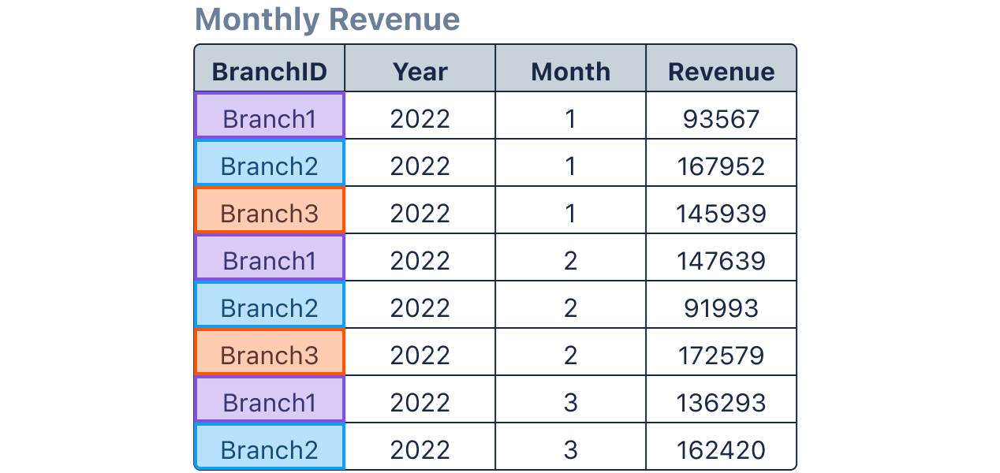
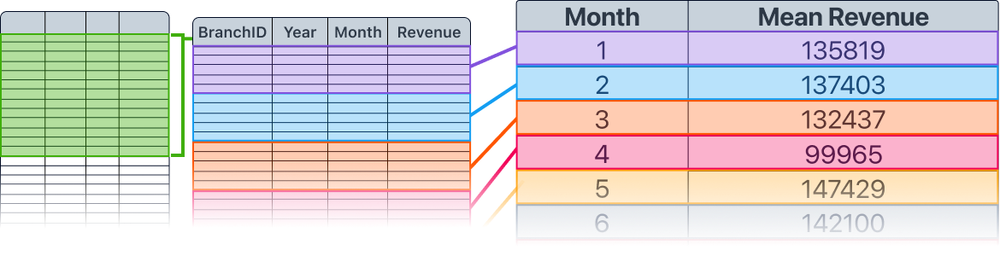
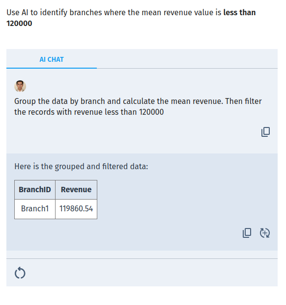
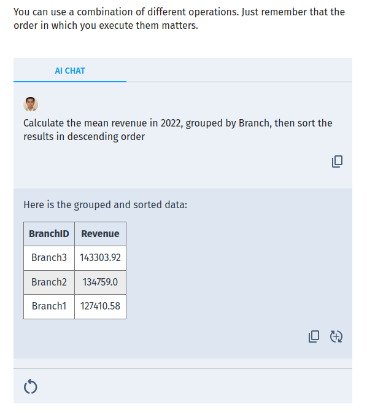

# Grouping Data

When working with large datasets, grouping allows you to see data in a new way and answer complicated questions.

In this lesson, you'll learn to group data to uncover new patterns and insights.

In this lesson, you'll work with the data from a hotel group. The revenue table above shows each branch's monthly revenue.

Grouping lets you organize similar data into categories. It’s often used to calculate summary statistics for each group of records.

Data is usually grouped by fields. The data in the image above is grouped by…

In the example above, we calculated the…

If we group the table above by Branch ID, how many records will we get?

You can combine grouping with filtering to analyze data.

When would it be best to use both methods?

Use AI to identify branches where the mean revenue value is less than 120000

Arrange the steps in the correct order to calculate the mean revenue for each month in 2022

To analyze the average monthly revenue for all branches in 2021, you will need to…

If you want to find all the branches where the total revenue is less than 1500, you will need to…

Let's recap!

Fantastic work! Now you know:

⭐ Grouping can help you answer questions about the data

⭐ You can use a combination of different types of operations

⭐ The order in which you execute the operations is important if you want accurate results