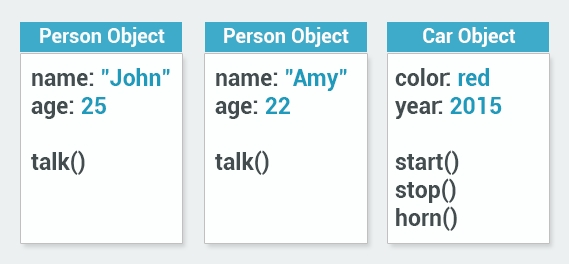

# 1. What is an Object

## Object Oriented Programming
Object-Oriented Programming (OOP) is a programming style designed to make programming concepts closer to the way we think about the real world.

In OOP, **objects** are independent units with their own unique identity, just like real-world objects.

For example, an apple and a mug are objects. Each has its own unique identity. Even if there are two identical mugs, they are still separate, unique objects.

### Key Characteristics of an Object:

- **Attributes**: Characteristics or properties of an object. For example, a car can be red or blue, a mug can be full or empty.
- **Behavior**: What an object can do or how it behaves. For example, a car can move, a phone can ring.
- **Identity**: The uniqueness of an object, which makes it distinguishable from other objects.

Objects can have multiple **attributes**. For example, a mug can be red, large, and full. An object’s state (like whether a cup is full or empty) is independent of its type.

### What are the Three Key Descriptions of an Object in OOP?

1. **Identity**: The unique identifier of an object.
2. **Attributes**: The current state of an object.
3. **Behavior**: What the object can do.

### Objects in Programming
Objects in programming may represent both **physical** and **abstract** concepts. For example, an object can represent a bank account or a date, neither of which are physical objects, but both have attributes and behaviors.

### Example:
A bank account is an object:
- **Identity**: The account number.
- **Attributes**: The balance, account holder's name.
- **Behavior**: Withdrawal, deposit, check balance.

---

### Question:
What are the three things that describe an object in object-oriented programming?

- Identity, attributes, behavior
- Strength, loyalty, identity
- Attributes only

---

### In regard to objects, which two of the following statements are true?

- [ ] Objects are always visible items.
- [x] Objects are not always visible items.
- [x] Objects are not always physical items.
- [ ] Objects are always physical items.

