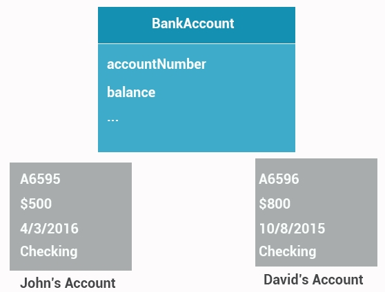

# 4. Abstraction


## Abstraction
Data abstraction is the concept of providing only essential information to the outside world. It represents key features without including implementation details.

### Example:
A good real-world example is a **book**: 
- When you hear the term "book", you don't know the exact specifics (e.g., page count, color, size), but you understand the general concept of a book. This is the abstraction of the book.

The concept of abstraction is that we focus on essential qualities rather than the specific characteristics of one particular instance.

### Quiz:
What does abstraction mean?
- nothing
- an object type
- **focus on the essential qualities of something**

## Abstraction in Programming
Abstraction allows us to have an idea or a concept that is independent of specific instances. It is one of the fundamental building blocks of object-oriented programming (OOP).

For example:
```cpp
cout << "Hello!" << endl;
```
In this example, when you use `cout`, you're using the `cout` object of the `ostream` class. This streams data to standard output. You don't need to know how `cout` displays the text on the screen—only its public interface is necessary.

### Quiz:
Which statement about abstraction is true?
- An abstraction is a way to declare functions for a class
- Abstraction is not related to object-oriented programming
- **We can have a concept, but it's separate from any specific instance**



## Practical Use of Abstraction
Abstraction allows us to write a **single bank account class**, then create different objects based on that class for individual bank accounts, rather than creating a separate class for each account.

Abstraction serves as a foundation for other object-oriented programming (OOP) concepts, such as inheritance and polymorphism.

### Quiz:
What is the foundation that supports other fundamentals of object orientation, such as inheritance and polymorphism?

**Answer: Abstraction**
