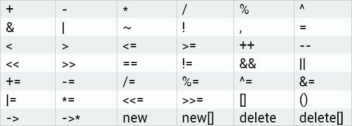

# 17. Operator Overloading

### Operator Overloading 
Most of the C++ built-in operators can be redefined or overloaded. This allows operators to be used with user-defined types as well (for example, allowing you to add two objects together).

This chart shows the operators that can be overloaded:



Operators that **cannot** be overloaded include:
- `::` (scope resolution)
- `.` (member access)
- `.*` (pointer-to-member access)
- `?:` (ternary operator)

### Example: Declaring a Class
Drag and drop from the options below to declare a class `Sally` with only a constructor in its public section.

```cpp
class Sally {
 public:
  Sally();
};
```

### Operator Overloading Example
Let's declare a sample class to demonstrate operator overloading:

```cpp
class MyClass {
 public:
  int var;
  MyClass() {}
  MyClass(int a) : var(a) { }
};
```

Our class has two constructors and one member variable. We will overload the `+` operator to enable adding two objects of our class together.

### Fill in the Blanks: Class Declaration
Fill in the blanks to declare a class `Sally`, with two constructors: one default constructor (without parameters), and one constructor with an integer parameter.

```cpp
class Sally {
 public:
  Sally(); 
  Sally(int a);
};
```

### Defining the Overloaded Operator
Overloaded operators are functions, defined by the keyword `operator` followed by the symbol for the operator being defined. An overloaded operator is similar to other functions: it has a return type and a parameter list.

In our example, we will overload the `+` operator. It will return an object of our class and take an object of our class as its parameter.

```cpp
class MyClass {
 public:
  int var;
  MyClass() {}
  MyClass(int a) : var(a) { }

  MyClass operator+(MyClass &obj) {
      // Define operator behavior here
  }
};
```

### Question: Keyword for Operator Overloading
Which choice is the keyword for overloading an operator in C++?

- overload_it
- this
- **operator** (Correct)
- friend

### Implementing the Overloaded Operator
We need our `+` operator to return a new `MyClass` object with a member variable equal to the sum of the two objects' member variables.

```cpp
class MyClass {
 public:
  int var;
  MyClass() {}
  MyClass(int a) : var(a) { }

  MyClass operator+(MyClass &obj) {
      MyClass res;
      res.var = this->var + obj.var;
      return res; 
  }
};
```

Here, we declared a new `res` object. We assigned the sum of the member variables of the current object (`this`) and the parameter object (`obj`) to the `res` object's `var` member variable. The `res` object is returned as the result.

This allows us to create objects in `main` and use the overloaded `+` operator to add them together.

### Complete Example with Overloaded `+` Operator

```cpp
#include <iostream>
using namespace std;

class MyClass {
    public:
        int var;
        MyClass() { }
        MyClass(int a) : var(a) { }

        MyClass operator+(MyClass &obj) {
            MyClass res;
            res.var = this->var + obj.var;
            return res; 
        }
};

int main() {
    MyClass obj1(12), obj2(55);
    MyClass res = obj1 + obj2;

    cout << res.var;
}
```

With overloaded operators, you can use any custom logic needed. However, it's not possible to alter the operators' precedence, grouping, or number of operands.

### Question: Defining an Overloaded `+` Operator
Drag and drop from the options below to define an overloaded `+` operator for the class `Test`.

```cpp
Test Test::operator+(Test obj) {
    Test newObj;
    newObj.mem = mem + obj.mem;
    return newObj;
}
```