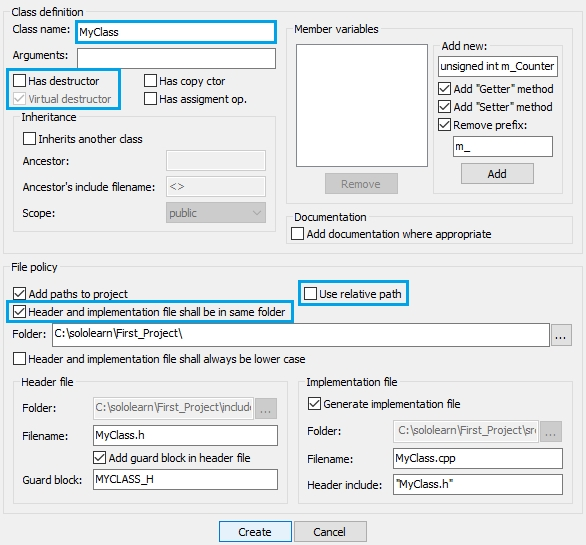
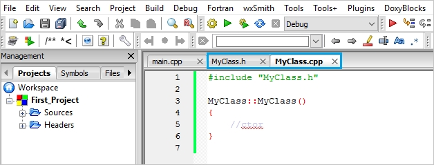

# 8. Separate Files for Classes

## Creating a New Class

It is generally a good practice to define your new classes in separate files. This makes maintaining and reading the code easier.

To do this, follow these steps in CodeBlocks:

1. Click **File** -> **New** -> **Class...**

   

2. Give your new class a name, uncheck "Has destructor," and check "Header and implementation file shall be in same folder," then click the "Create" button.

### Files Added to Your Project

After creating a class, two new files are added to your project:

   

### Which Two Files Are Defined for a Class?

- **Header** and **Source**

### Source & Header

- The **header file** (`.h`) holds the **function declarations** (prototypes) and **variable declarations**.
- The **source file** (`.cpp`) holds the **implementation** of the class and its methods.

#### MyClass.h

The header file for a class (e.g., `MyClass.h`) looks like this:

```cpp
#ifndef MYCLASS_H
#define MYCLASS_H

class MyClass
{
  public:
    MyClass();
  protected:
  private:
};

#endif // MYCLASS_H
```

- The `#ifndef` and `#define` statements are used to prevent **multiple inclusions** of the header file.

#### MyClass.cpp

The source file for the class (e.g., `MyClass.cpp`) includes the implementation of class methods:

```cpp
#include "MyClass.h"

MyClass::MyClass()
{
   // Constructor
}
```

- The `#include "MyClass.h"` statement links the source file to the corresponding header file.

### What Is the Header File Used For?

- **Function prototypes** and **variable declarations**

## Scope Resolution Operator

The double colon (`::`) in the source file (`.cpp`) is called the **scope resolution operator**. It is used to define a class's member functions, which were declared in the header file.

For example, the constructor `MyClass::MyClass()` is defined as follows:

```cpp
#include "MyClass.h"

MyClass::MyClass()
{
   // Constructor implementation
}
```

- The `MyClass::MyClass()` refers to the **constructor** of the `MyClass` class.

## Using Classes in `main.cpp`

To use a class in the `main` function, you need to include the **header file**:

```cpp
#include <iostream>
#include "MyClass.h"

using namespace std;

int main() {
  MyClass obj;  // Creating an object of MyClass
}
```

- The **header file** declares "what" a class will do, while the **cpp file** defines "how" it will perform those tasks.

### To Use a Class in `main.cpp`, What Should Be Included?

- **The class's header file** (`MyClass.h`) should be included.