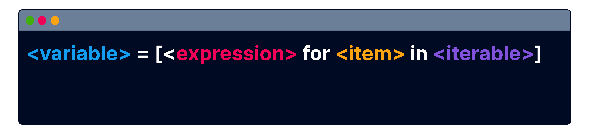

# list comprehensions

Creating lists from scratch can sometimes be time-consuming, requiring you to manually write all the items or iterate through them with a loop.

In this lesson, you will learn how to perform these operations much more efficiently using list comprehensions.

Let's imagine you need to create a list containing numbers from 1 to 50.

Here is the code you would need to write:

```py
nums = []

for x in range(1,51):
  nums.append(x)

print(nums)
```

List comprehensions are useful shorthands for such operations. They offer a shorter and more readable way to create lists with various settings using just a single line of code.

```py
nums = [x for x in range(1,51)]

print(nums)
```

Use a list comprehension to create a list containing numbers from 0 to 9

```py
nums = [ for x range(10)]
```

List comprehensions are created using square brackets []

Complete the code

```py
nums
x
x in range(10)
```


Here is the generic syntax and structure of a list comprehension:

<variable>: the variable that will store the newly created list
<expression>: an expression performed on each item. If no specific action is needed, the item itself is used
<item>: the current item being processed
<iterable>: any iterable object, such as ranges, lists, strings, tuples, and sets


Translate course
True or False? List and strings are an iterables

False
True

You can apply any expression to each item in the list being created with a list comprehension.

For instance, the following code doubles each value in range(10) and stores the results in a list:

```py
nums = [x*2 for x in range(10)]

print(nums)
```

```py
nums = [x+1 for x in range(10)]

```
Match the elements with their corresponding names

expression:
item:
iterable:

You can use a list as the iterable in a list comprehension.

For example, this code will iterate through the original list of tags, adding a '#' symbol to the beginning of each tag to create a new list of hashtags.

```py
tags = ["travel", "vacation", "journey"]

hashtags = ["#" + x for x in tags]
print(hashtags)

```

```py
tags = ["travel", "vacation", "journey"]
hashtags = ["#" + x for x in tags]
```


What does the expression perform in this list comprehension?

capitalization
multiplication
concatenation

```py
cities = ['madrid', 'paris', 'lisabon']
```
Create a list with capitalized strings taken from cities list

```py
cities_cap = [x.
for
in
]
```

You can incorporate a condition into a list comprehension, placed after the iterable.

For example, the following code filters out names that start with B

```py
users = ["Brandon", "Emma", "Brian", 
"Sophia", "Bella", "Ethan",
"Ava", "Benjamin", "Mia", "Chloe"]

group = [x for x in users if x[0] == "B"]

print(group)
```
```py
group = [x for x in names if x[0] != "A"]
```

The group list, defined by the list comprehension above, will hold strings that...

start with A
don't start with A
don't include A

```py
sports = ["Football", "Basketball", "Tennis", "Golf", "Volleyball"]
group = [x for x in sports if "ball" in x]
```

The group list, defined by the list comprehension above, will hold strings that...

don't include the word ball
start with the word ball
include the word ball

```py
scores = [68, 74, 89, 64, 85, 93]
```
Create a list that includes only the values from the scores list that are higher than 80
```py
winners = [x for x 
 scores 
 
 > 80]

```

Lesson Takeaways
Fantastic work! Here's what you've learned:

 

🌟 list comprehensions provide a concise and readable method for creating lists, allowing you to define various settings in just a single line of code

🌟 with list comprehensions, you can apply any expression to each item in the list being created

🌟 you can also incorporate a condition into a list comprehension

