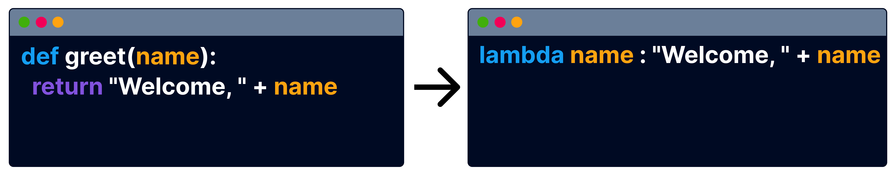

# lambda expressions


Translate course
Functional programming has advantages in terms of making your code more efficient and organized.

 

In this lesson you will learn about lambda expressions - efficient feature in Python, allowing you to create compact, throwaway functions without needing the formal structure of a standard function definition.

```py
def total(price, count):
  return price*count

print(total(2,3))
```

Let's do a warm-up!

What will this code output?

total
2 3
6

True or False?

You can assign function to a variable

False
True

```py
def welcome(name):
  return "Welcome, " + name
greet = welcome
```

Identify the elements

greet:
welcome:



Lambda expressions are functions without a name that are quick to create and use. They are written in just one line using the lambda keyword and are often used for small, simple tasks.

```py
greet = lambda name: "Welcome, " + name

print(greet("Bob"))
```

Define a lambda expression

lambda x: x+5

Lambda expressions are called anonymous functions. This means that:

They can't be called
They don't need a name while being defined

Lambda expressions perform a single operation and return a result. They are defined using the lambda keyword, followed by its arguments, a colon, and the expression to perform.

Complete the lambda expression to take a word as an argument and produce a hashtag

```py
lambda word : '#' + word
```

lambda price: price * 0.9
PY
Identify the elements

argument:
expression:

You can assign the lambda expression to a variable and then call it as a regular function.

```py
discount = lambda price: price * 0.9 
print(discount(100))
```

Lambda expressions can take multiple arguments separated by commas.

Code a lambda expression with 2 arguments

```py
lambda height, width : width * height
```

```py
lambda price , count : price * count
```

Identify the elements

arguments: price, 
expression: 

```py
x = lambda price, count :  price * count
print(x(2,10))
```

What's the output of this code?

x
12
20

Lambdas execute single, concise expressions. They are more limited than regular functions, which can have multiple lines and actions, and are ideal for straightforward, simple operations.

Code a lambda expression

```py
lambda x,y : x*y
```

You can provide arguments to lambda expressions on-the-fly by adding them in parentheses immediately after the lambda function. The lambda expression should be also enclosed in parentheses.

```py
res = (lambda x, y: x + y) (2, 3)
print(res)
```

```py
res = (lambda x, y: x*y) (2,3)
```

What value is assigned to the variable res?

the lambda expression
5
6

The power of lambda is better shown when you use them as an anonymous function inside another function. Say you have a function definition that takes one argument, and that argument will be multiplied with an unknown number:

```py
def mult(n):
  return lambda a : a * n

doubler = mult(2)
tripler = mult(3)

print(doubler(5))
print(tripler(5))
```

Code a lambda expression to apply a discount to a price

```py
_  price _ _  * 0.9
```

Lesson Takeaways
Amazing! You learned that:

 

🌟 Lambda expressions are compact, anonymous functions used for simple operations

🌟 Lambda expressions can be assigned to variables or used within other functions for on-the-fly operations