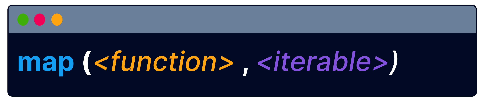
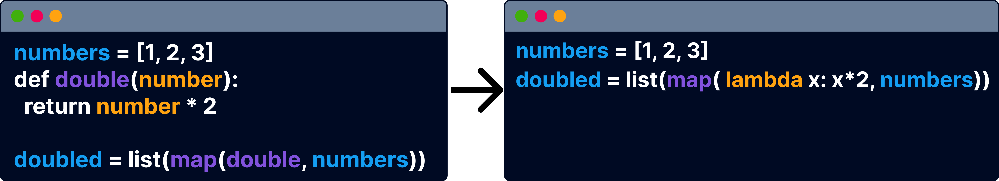

# map and filter

The power of lambda expressions becomes evident when working with data manipulation and transformation tasks.

 

In this lesson, you will learn how to effectively use lambda expressions with functions that are specifically designed for processing and transforming iterables


First, let's do some warm up!

 

True or False?

The return keyword is used while defining a regular expression

True
False

Define a lambda expression
```py
lambda x : x+5
```

Complete the lambda expression to take a word as an argument and capitalize it

```py
lambda word : word.upper()
```

Code a lambda expression with 2 arguments

Which one of the following is an iterable?

integer
boolean
list


Translate course
The map() function applies a specified function to every element in an iterable, like lists or tuples. It produces a result that can be transformed into a list using the list() function for easy viewing or further use.

```py
#List of names in various cases
names = ["alice", "bob", "CHARLIE", "dEborah"]

# Function to capitalize each name
def capitalize(name):
  return name.capitalize()

# Using map() to apply the capitalization to each name
capitalized = map(capitalize, names)

# Converting map object to a list
capitalized = list(capitalized)

print(capitalized)
```

The map function takes two arguments - an iterable and…

an integer
a boolean
a function

```py
prices = [25.99, 14.50, 8.75, 19.95]
def discount(price):
  discounted_price = price * 0.9
  return discounted_price

discounted_prices = list(map(discount, prices))
```
Identify the arguments with their types

discount: 
prices: 


The map function requires the first argument to be a function and the second argument to be an iterable.

The code below has a mistake. Can you fix it?
```py
exam_scores = [85, 62, 95, 40, 78]
def is_passing(score):
  return score >= 70

status = list(map(exam_scores,is_passing))

print(status)
```
```py
exam_scores = [85, 62, 95]
def is_passing(score):
  return score >= 70

status = list(map(is_passing, exam_scores))
```

What data type will the elements of the status list have

integer
string
boolean


Do you remember lambda expressions? Another valuable aspect of them is their ability to be directly provided to the map function. This eliminates the need to define a regular function explicitly.

```py
numbers = [1, 2, 3]
doubled = list(map(lambda x: x*2, numbers))

print(doubled)
```

Translate course
Write a map function that adds 5 to each item in the iterable scores


map( lambda x: x+5,)

The filter() function, just like the map() function, takes in a function and an iterable as arguments. The key purpose of filter() is to apply a condition specified in the provided function to each item in the iterable and return only those for which the function evaluates to True.

This code filters and returns products with names 4 characters long.

```py
products = ["Table", "Sofa", "Cushion", "Bookshelf", "Vase"]

# Filters products with name length equal to 4
filtered_prod = list(filter(lambda name: len(name) == 4, products))

print(filtered_prod)
```

The filter() function is particularly useful for extracting subsets of data that meet certain criteria.

Complete the code to filter out values from the prices list that are less than 90


filter( lambda price: price < 90, prices)

Match the definitions

Transforms the items of an iterable: 
Returns items that meet a condition: 

The map() and filter() functions can work with any iterable. In the example below, filter() is used to extract items from the products dictionary, where prices are under 90.

```py
products = {'Table': 110, 'Sofa': 120, 'Chair': 45, 'Lamp': 70}

#filtering products with prices less than 90
filtered_products = dict(filter(lambda item: item[1] < 90, products.items()))

print(filtered_products)
```

```py
names = ["John", "Emma", "Jake", "Rachel", "James"]
filtered = list(filter(lambda name: name[0] == 'J', names))

```

Lesson Takeaways
Amazing job! You've learned that:

 

🌟 The map() function applies a specified function to every element in an iterable

🌟 The filter() function filters out items from an iterable based on a specified condition

🌟 Both can accept lambda expressions as arguments