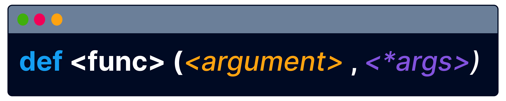
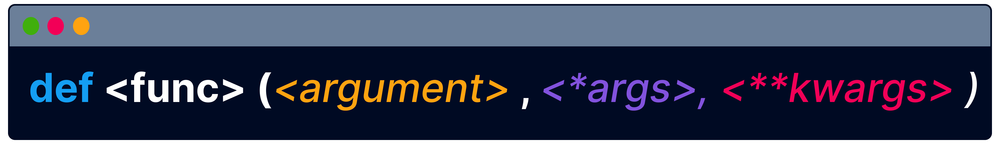

# args and kwargs


Translate course
Up to this point, you've been defining functions with a fixed number of known arguments.

 

In this section, you will learn about techniques that enhance the adaptability of functions, making them more versatile and ready for different scenarios.

```py
def total(x, y, z):
  return x + y + z
```

First, let's do a warm-up exercise!

How many arguments does this function accept?

2
1
3

True or False?

When calling a function, you need to use the same number of arguments that have been defined, in the same order.

False
True

```py
def total(x, y, z):
  return x + y + z

print(total(2, 1, 3, 3))
```

When calling a function, you need to use the same number of arguments that have been defined, in the same order.

What's the output of this code?

6
an exception
9

If the number of arguments of your function is unknown and unpredictable, you can always use an iterable as an argument.

```py
def total(numbers):
  result = 0
  #iterating over the list
  for i in numbers:
    result+=i
  return result

nums = [1,2,3,4,5]

print(total(nums))
```

*args allows you to provide any number of arguments without the need to create a list before calling the function each time.

For example

```py
def total(*args):
  result = 0
  for arg in args:
    result += arg
  return result

print(total(1, 2, 3, 4, 5))
print(total(1, 2, 3, 4, 5, 6, 7))
print(total(1, 2, 3))
```


Translate course
*args receives arguments as a tuple, which can be used inside the function.

Tuple is…

an iterable
a function
a loop

You need to use the unpacking operator * before args. This operator informs Python that the argument is an iterable and should be unpacked to receive its values as individual arguments.


```py 
def total (*args)
```


Translate course
Note that args is just a name. You’re not required to use the name args. You can choose any name that you prefer.

```py
def total(*prices):
  result = 0
  for arg in prices:
    result += arg
  return result

print(total(1, 2, 3, 4, 5))
print(total(1, 2, 3, 4, 5, 6, 7))
print(total(1, 2, 3))

```

Complete the function definition
```py
def display(*words):
    for item in *word:
        print(item)
```

```py
def display(*words):
  for item in words:
    print(item)
display("paper", "pen", "pencil")
```

How many lines of output will this code produce?

3
2
1


When defining a function with both regular arguments and *args, the regular arguments must come before *args in the function definition.

```py
def show_items(category, *items):
  print("Category: " + category)
  for item in items:
    print(item)

show_items("Electronics", "Laptop", "Smartphone", "Tablet")
```

The first line of the function definition, which includes the function name and its parameters, is called function signature.

Complete the function signature
```py
def display(team, *players)
```

Python also allows you to pass keyword arguments using **kwargs. In this case, **kwargs receives arguments in the form of a dictionary, consisting of key:value pairs.

```py
#**kwargs is a dictionary
def display_info(**kwargs):
  #kwargs.items() returns the key:valie pairs
  for key, value in kwargs.items():
    print(key, ":", value)

display_info(name="Alice", age=30, city="New York")
```

The ** operator in Python is used to unpack dictionaries into arguments. It enables a function to accept an arbitrary number of keyword arguments, converting these arguments into a dictionary of key:value pairs.

Complete the function signature with keyword arguments

```py
def info(**user):
```

Match the argument types with their respective operators
args : *
kwargs : **

Match the argument types with the data types they receive

*args: list  
**kwargs: dictionary


In a function definition, the order of arguments is important. First, regular arguments are listed, followed by *args for positional arguments, and finally **kwargs for keyword arguments.

Complete the function signature
```py
def show(class, *students, **info)
```

Lesson Takeaways
You're fantastic! You learned that:

 

🌟 *args enables you to pass an arbitrary number of positional arguments to a function

🌟 **kwargs allows you to pass keyword arguments to a function

🌟 *args collects arguments into a tuple, while **kwargs groups them into a dictionary with key:value pairs

🌟 'args' and 'kwargs' are conventional names, but you can use any names you prefer for these