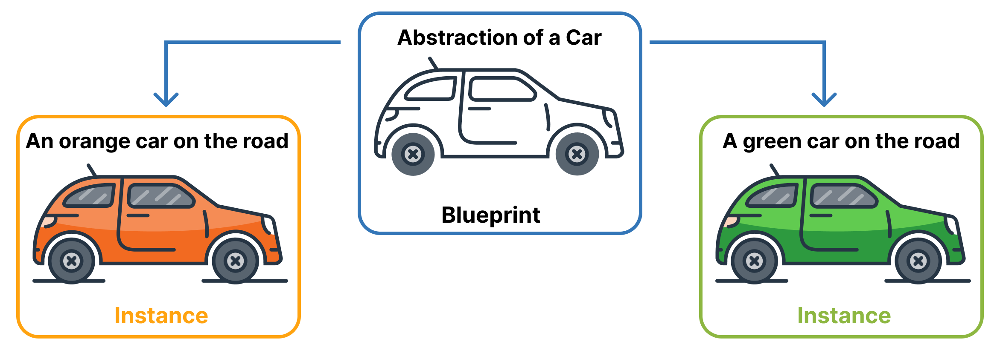
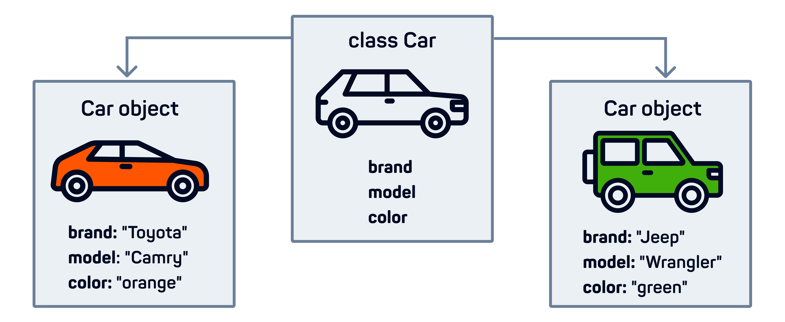

## Introduction to OOP

You've made fantastic progress and have mastered many fundamental Python concepts, including variables, data types, loops, iterables, and functions. Now, it's time to delve into another essential programming paradigm: object-oriented programming (OOP).

In this lesson, you will learn about classes and objects and how they are created in Python.


In the real world, most things have a 'blueprint' and multiple instances of it. By 'blueprint,' we refer to an abstract set of properties and behaviors. Take, for example, a 'car.' It's a blueprint, or a general idea, covering properties like having four wheels, a color, engine power, and so on. The cars you see on the road are specific instances of this general blueprint, each with its unique characteristics like color, make, and model.

### How many instances can a blueprint have?

- Maximum two
- Only one
- As many as needed

In programming, there is a paradigm that follows the same principle as blueprints and instances. It's called object-oriented programming (OOP). In OOP, blueprints are referred to as classes, and the instances are known as objects.

Use the image to identify the elements:

- **Abstraction of a Car:**
- **A Green Car on a website:**

Imagine a company conducting an email survey. They send the same survey template to all their customers, who then fill it out with their own information.

Identify the elements:

- **The survey template:**
- **The completed survey form by a customer:**

```python
class Car:
```

In Python, you can define a class by using the `class` keyword followed by the class name and a colon.

### Define a Dog class


In the real world, everything has distinguishing characteristics: a dog has its breed, color, and name; a car has its brand, model, and color. In programming, classes and objects mirror this concept with attributes. Attributes are the properties that define an object's individuality within a class.

Use the image to select all the attributes of the Car class:

To add attributes to a class, you must define the `__init__` method. This method's first parameter is always `self`, which represents the instance of the class. Following `self`, you specify the attributes you wish to include. Then, inside the function, you assign values to the initialized object's attributes, setting their initial state.

```python
class Car:
  # Initialize attributes
  def __init__(self, brand, color):
    # Assign values to attributes
    self.brand = brand
    self.color = color

# Create an object of the Car class
my_car = Car('Audi', 'yellow')

print(my_car)
```

### Add an attribute breed to the Dog class

```python
class Dog:
  def __init__(self, breed, color):
    self.breed = breed
    self.color = color

# Create an instance of a Dog class
my_dog = Dog("Golden Retriever", "white")
```

```python
class Car:
  def __init__(self, brand, model, color):
    self.brand = brand
    self.model = model
    self.color = color
```

### How many attributes does this class have?

- 4
- 2
- 3

After an object is created, you can access its attributes by using the dot `.` notation with the variable holding the object.

```python
class Car:
  # Initialize attributes
  def __init__(self, brand, color):
    # Assign values to attributes
    self.brand = brand
    self.color = color

# Create an object of the Car class
my_car = Car('Audi', 'yellow')

# Display attribute values
print(my_car.brand)
print(my_car.color)
```

```python
my_car = Car('Toyota', 'green')

print(my_car.brand)
```

### What will be the output?

- brand
- green
- Toyota

In addition to attributes, you can add custom behaviors to a class by defining functions within it. These functions, known as methods, should include the `self` parameter to interact with the class instance. You can call these methods using the dot `.` notation, similar to how you access attributes.

```python
class Car:
  def __init__(self, brand, color):
    self.brand = brand
    self.color = color
    
  def honk(self):
    print("Beep beep!")

my_car = Car('Audi', 'yellow')

my_car.honk()
```

The main difference between functions and methods is that functions are independent and can be called on their own, while methods are associated with a class and can be called only with its instance. This means that you can't call a method without having the instance of a class where that method is defined.

### Identify the elements

- **print():**
- **my_car.honk():**

There are many built-in methods in Python, some of which you already are familiar with. For example, the `lower()`, `upper()`, and `capitalize()` methods are commonly used on string objects.

### Convert the string value to uppercase

```python
"madrid".upper()
```

Everything in Python, including functions, is an object. For instance, integers are instances of the `int` class, and functions are instances of the `function` class, among others. This object-oriented nature underlies Python's flexibility and power.

```python
# function
def greet():
  print("Welcome!")

# list
prices = [55, 68, 77, 36]

# data types
x = 5
city = "London"
is_open = True

print(type(greet))
print(type(prices))
print(type(x))
print(type(city))
print(type(is_open))
```

### Define a User class with a name attribute

```python
class User:
  def __init__(self, name):
    self.name = name
```

## Lesson Takeaways
Amazing job! Here are your key takeaways:

- 🌟 Object-oriented programming is a paradigm centered on classes and objects
- 🌟 Using a class constructor is essential for generating an object from a class
- 🌟 Attributes and methods can be defined within a class to give it functionality
```