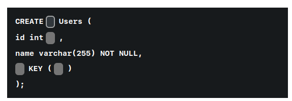
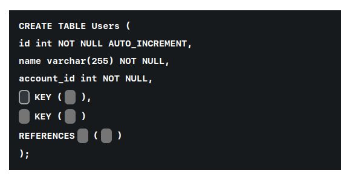

1. Create a table with an auto incremented column called id, which is the primary key.



To create a table with an auto-incremented column called `id`, which is the primary key, you can use the following SQL command. The highlighted parts indicate the necessary elements for creating the auto-incremented column and setting it as the primary key:

```sql
CREATE TABLE Users (
    id int AUTO_INCREMENT,
    name varchar(255) NOT NULL,
    PRIMARY KEY (id)
);
```

In this command:
- `AUTO_INCREMENT` is used to automatically generate a unique value for the `id` column whenever a new record is inserted.
- `PRIMARY KEY (id)` sets the `id` column as the primary key of the table.

2. True or False: A table can have multiple primary keys.

True
False -- answer


3. Drag & drop to create a table 'Users' with a primary key on the column id and a foreign key column 'account_id', referring to the Accounts table's id column.



To complete the SQL statement for creating a table named `Users` with an auto-incremented `id` column, and adding foreign key constraints, you can use the following syntax. The example assumes you are referencing another table named `Accounts` with a primary key of `id`.

```sql
CREATE TABLE Users (
    id int NOT NULL AUTO_INCREMENT,
    name varchar(255) NOT NULL,
    account_id int NOT NULL,
    PRIMARY KEY (id),
    KEY (account_id),
    CONSTRAINT fk_account FOREIGN KEY (account_id) REFERENCES Accounts(id)
);
```

In this code:
- `PRIMARY KEY (id)` sets the `id` column as the primary key.
- `KEY (account_id)` creates an index on the `account_id` column to speed up queries involving this column.
- `CONSTRAINT fk_account FOREIGN KEY (account_id) REFERENCES Accounts(id)` sets `account_id` as a foreign key that references the `id` column in the `Accounts` table.


5. A database has a table called 'Users' and a table called 'Transactions'. Each user can have multiple transactions. 

Which table should have a foreign key to create this relationship?

Transactions -- answer
Both
Customers