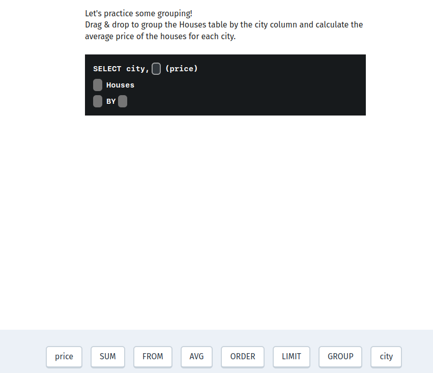
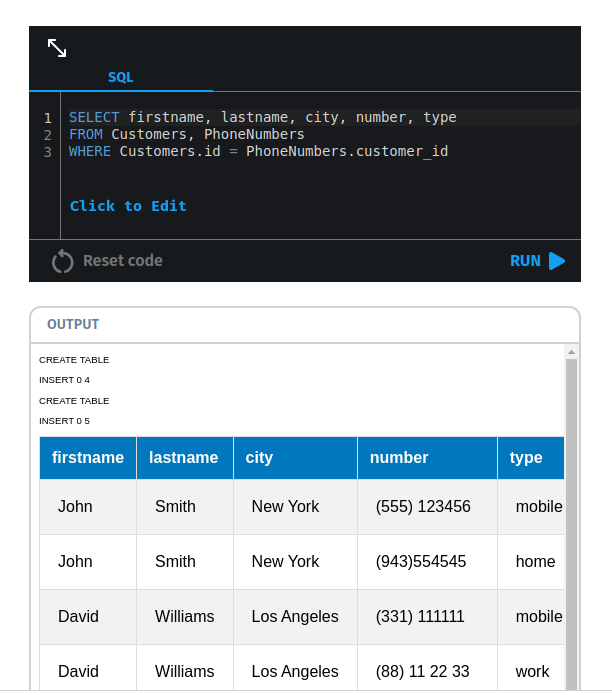
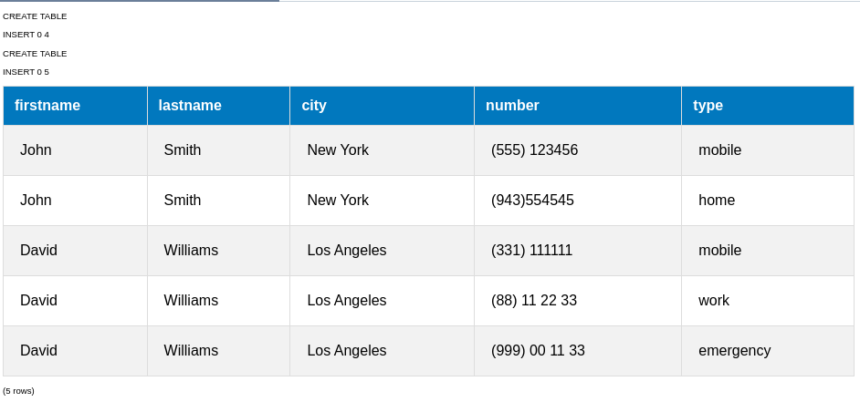

# Multiple Tables 

Often, data is stored in multiple linked tables.
As an example, consider our Customers and PhoneNumbers tables.
The Customers table includes information about customers, while the PhoneNumbers table contains the phone numbers of the customers.

SQL enables you to work with multiple tables using a single query.
For example, let's say we want to select the phone numbers of the customers in our Customers table that have a certain type and a certain age.
This means we need to have conditions on both tables and select the linked data. 


Translate course
Let's practice some grouping!

Drag & drop to group the Houses table by the city column and calculate the average price of the houses for each city.



True or False: The foreign key column should be unique.

True
False -- answer

Multiple Tables 
We can select data from multiple tables by comma separating them in a SELECT statement:
Note the WHERE condition: it tells SQL to combine only those rows that have the corresponding customer_id.

Without it we would get all possible variants of the first table linked with the second table.



You are working with the tables Products and Orders. Each product has an id, while the Orders table has a referencing product_id.
Drag & drop to select the name from the products table and the corresponding price from the orders table.

You are working with the tables Products and Orders. Each product has an id, while the Orders table has a referencing product_id.
Drag & drop to select the name from the products table and the corresponding price from the orders table.


When working with multiple tables, it's common practice to define the columns by their full name – the table name, followed by a dot and the column name.
For example: Customers.id is the id column of the Customers table, while PhoneNumbers.id is the id column of the PhoneNumbers table.
This makes the code more readable and avoids mistakes, when both tables have a column with the same name. 

Fill in the blanks to select the age column from the Users table using the full name of the column.


So, here is what our query would look like with the full column names:

```sql
SELECT Customers.firstname, Customers.lastname, Customers.city, PhoneNumbers.number, PhoneNumbers.type 
FROM Customers, PhoneNumbers
WHERE Customers.id = PhoneNumbers.customer_id  
```



Which of the following is the full column name for the column 'name' of the Employees table?

name.Employees
name AS Employees
Employees.name -- answer
Employees:name


Selecting data from multiple tables is easy!
Just separate their names in the SELECT statement with a comma and specify the condition for the linked columns.
In the next lesson we will learn a better and cleaner way to combine data in multiple tables.


You are working with a library database that stores data on books.
The Books table has the columns id, name, year, author_id.
The author_id column connects to the Authors table, which stores the id, name columns for the book authors.
You need to select all the books with their authors, ordered by the author name alphabetically, then by the year in ascending order.
The result set should contain only 3 columns: the book name, year and its author (name the column author). 
Use the full column names, as both tables have a column called name. 

```sql
SELECT 
    Books.name AS name, 
    Books.year, 
    Authors.name AS author
FROM 
    Books
JOIN 
    Authors
ON 
    Books.author_id = Authors.id
ORDER BY 
    Authors.name ASC, 
    Books.year ASC;

```
