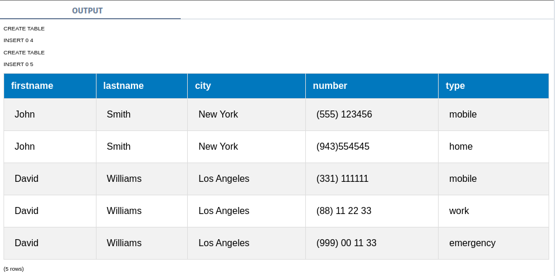
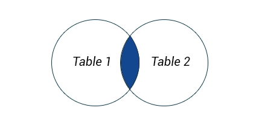
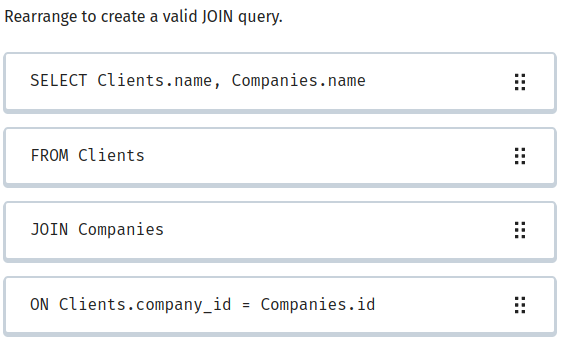
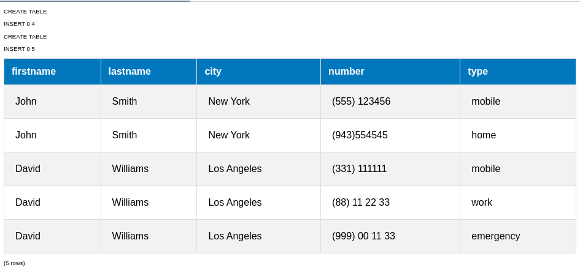
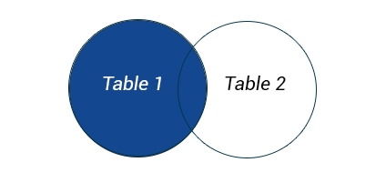
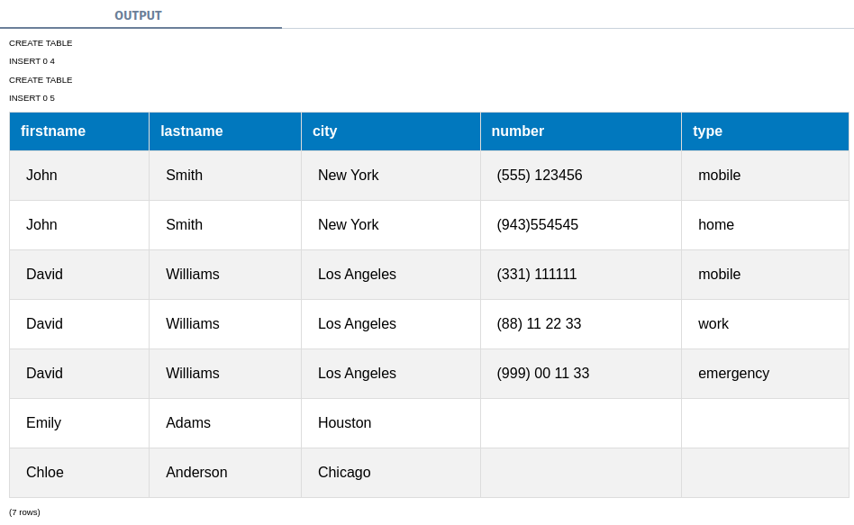
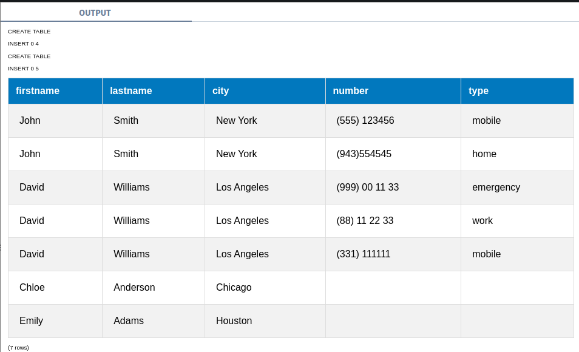

## JOINS 
A better way of combining data is the JOIN clause.
It allows you to combine multiple tables based on a condition.

```sql
SELECT firstname, lastname, city, number, type
FROM Customers JOIN PhoneNumbers
ON Customers.id = PhoneNumbers.customer_id
```



The image below demonstrates how JOIN works: 



Only the records matching the join condition are returned.



## Alias 
Because you use the full column names when joining tables, the query can get really long.

To make it easier and shorter, we can provide nicknames for our tables:

```sql
SELECT C.firstname, C.lastname, C.city, PN.number, PN.type
FROM Customers AS C JOIN PhoneNumbers AS PN
ON C.id = PN.customer_id 
```



## LEFT JOIN 
Another type of JOIN is the LEFT JOIN.

The LEFT JOIN returns all rows from the left table (first table), even if there are no matches in the right table (second table). 

This means that if there are no matches for the ON clause in the table on the right, the join will still return the rows from the first table in the result.

The image below demonstrates how LEFT JOIN works: 




For example, in our case, the Customers table includes customers that do not have any records in the PhoneNumbers table:

The result set contains all the rows from the left table and matching data from the right table.

If no match is found for a particular row, NULL is returned for the columns of the right table.

```sql
SELECT C.firstname, C.lastname, C.city, PN.number, PN.type
FROM Customers AS C LEFT JOIN PhoneNumbers AS PN
ON C.id = PN.customer_id
```


The table A contains 3 rows in the id column with the values 1, 2, 3. The B table has an id column containing 3 rows with the values 1, 2, 1.

How many rows will the following query return?

```sql
SELECT A.id, B.id FROM 
A LEFT JOIN B
ON A.id = B.id
```

## RIGHT JOIN 
Similarly, the RIGHT JOIN returns all the rows from the right table, even if there are no matches in the left table.

For example, we could rewrite the previous query this way:
We also sorted the results by the id column.

You can also use WHERE conditions or any other clause as you would with a simple SELECT query.

```sql
SELECT C.firstname, C.lastname, C.city, PN.number, PN.type
FROM PhoneNumbers AS PN RIGHT JOIN Customers AS C
ON C.id = PN.customer_id
ORDER BY C.id
```



If there is no corresponding row during a right join in the left table, its columns will contain: 

## Lesson Takeaways 
Awesome! 

Joins allow you to combine data from multiple tables based on conditions.

The LEFT JOIN returns all rows from the left table (first table), even if there are no matches in the right table (second table).

Similarly, RIGHT JOIN returns all the rows from the right table, even if there are no matches in the left table.

You will learn how to combine results of SELECT statements into one single data set in the next lesson, so stay tuned!

## Number of Books 
You are working on the library database, which contains the Books and Authors tables.

Columns of the Books table: id, name, year, author_id.
Columns of the Authors table: id, name.

Write a query to get the author names and the number of books they have in the Books table.

Note that some authors do not have any books associated with them. In this case, the result needs to include their names and have 0 as the count. The count column should be called books in the result.

Sort the result by the number of books, from highest to lowest.

```sql
SELECT 
    a.name AS name, 
    COUNT(b.id) AS books
FROM 
    Authors a
LEFT JOIN 
    Books b ON a.id = b.author_id
GROUP BY 
    a.name
ORDER BY 
    books DESC;

```