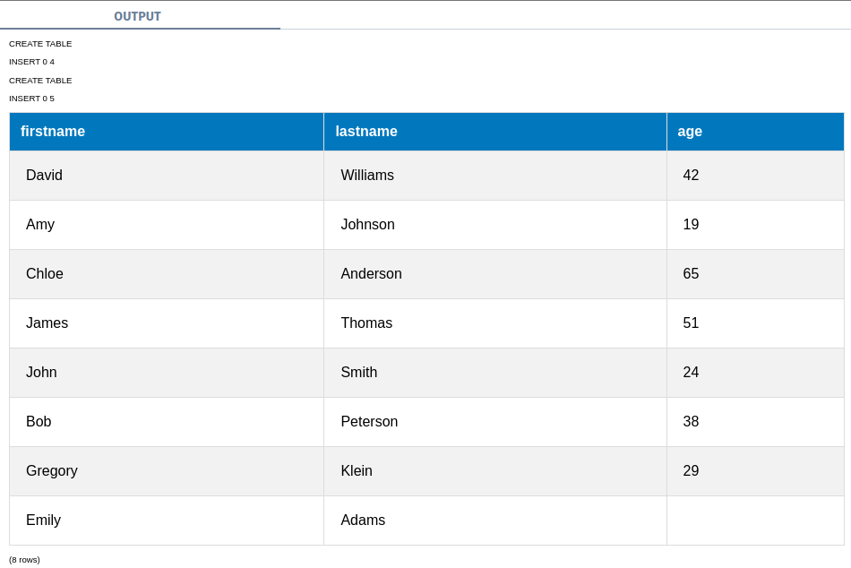
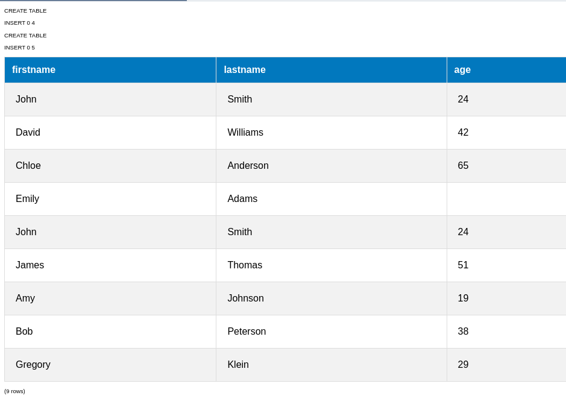
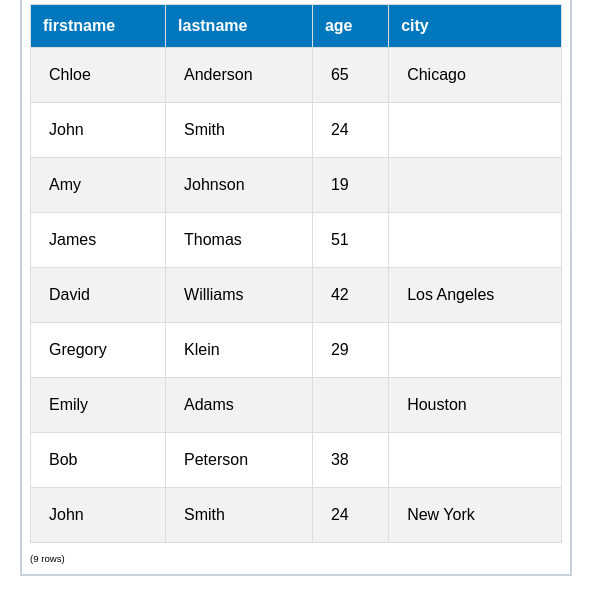
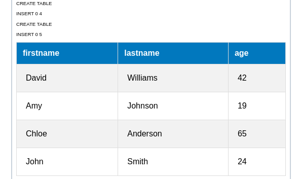
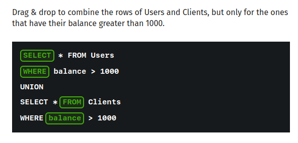

## UNION 
 
Occasionally, you might need to combine data from multiple similar tables into one comprehensive dataset. 
For example, you might have multiple tables storing Customers data and you want to combine them into one result set.
This can be done using the UNION statement.

The UNION operator is used to combine the result-sets of two or more SELECT statements.
Consider having a Customers and Contacts tables, both having firstname, lastname and age columns:

```sql
SELECT firstname, lastname, age FROM Customers
UNION
SELECT firstname, lastname, age FROM Contacts
```


All SELECT statements within the UNION must have the same number of columns. The columns must also have the same data types. Also, the columns in each SELECT statement must be in the same order.

UNION removes the duplicate records.



UNION requires:

same number of rows
linked tables
same number of foreign keys
same number of columns -- answer

## UNION ALL 
 
UNION ALL is similar to UNION, but does not remove the duplicates:
```sql

SELECT firstname, lastname, age FROM Customers
UNION ALL
SELECT firstname, lastname, age FROM Contacts
```




The table called 'A' contains 4 rows.
How many records will the following query return?
```sql
SELECT * FROM A
UNION
SELECT * FROM A

```

UNION 
Remember, the SELECT statements need to have the same columns for the UNION to work. In case one of the tables has extra columns that we need to select, we can simply add them to the second select as NULL:

```sql
SELECT firstname, lastname, age, city FROM Customers
UNION
SELECT firstname, lastname, age, NULL FROM Contacts
```



Here, the Customers table has an extra city column.

We can also use other constant values for the extra columns. Just remember, that the value has to have the same data type as the column of the first table.

Drag & drop to combine the rows of the Users and Clients tables.


UNION 
We can also set conditions for each select in the UNION.
Each SELECT statement can have its specific conditions.

For example:

```sql
SELECT firstname, lastname, age FROM Customers
WHERE age > 30
UNION
SELECT firstname, lastname, age FROM Contacts
WHERE age < 25
```





## Lesson Takeaways 
Great progress!

To summarize this lesson:

 - UNION allows you to combine records from multiple SELECT statements into one dataset.

 - For UNION to work, each SELECT statement needs to have the same number of columns and matching data types.

 - UNION removes duplicate records, while UNION ALL does not remove them.

 - Each SELECT statement in a UNION can have its own conditions. 

Next you will learn how to solve a real-life SQL challenge!

## PRACTICE EXERCISE
New Arrivals 
You are working with the library books database.

The Books table has the columns id, name, year.

The library has new books whose information is stored in another table called "New", however they do not have a year column.

Write a query to select the books from both tables, Books and New, combining their data. For the year column of the New books use the value 2022.

Also, select only the books that are released after the year 1900. 

The result set should contain the name and year columns only, ordered by the name column alphabetically.

```sql
SELECT name, year
FROM Books
WHERE year > 1900

UNION

SELECT name, 2022 AS year
FROM New

ORDER BY name;


```