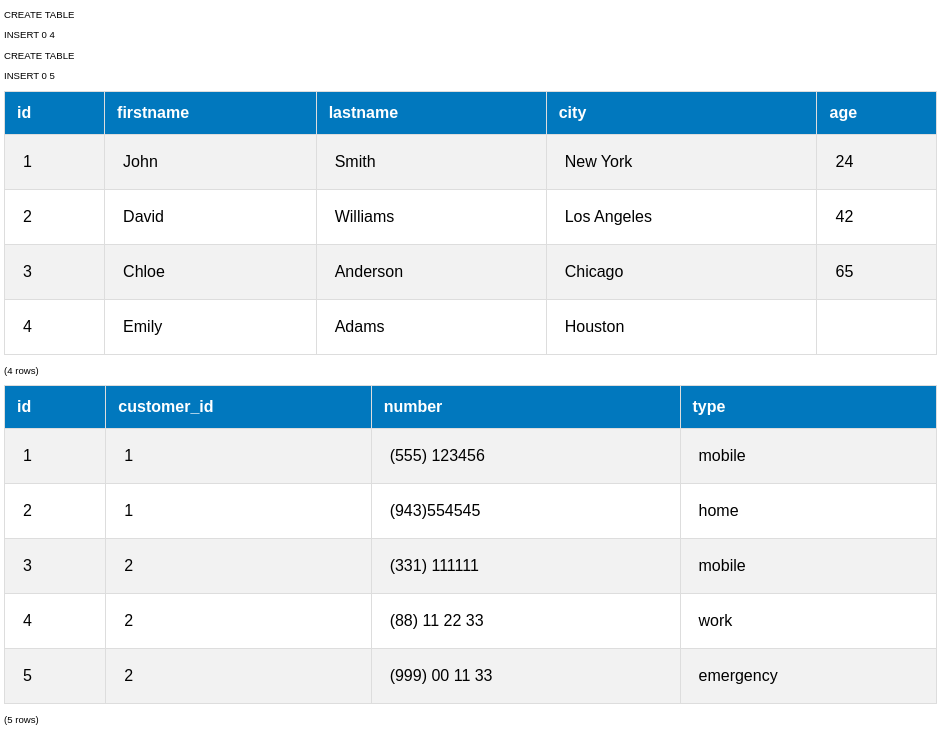
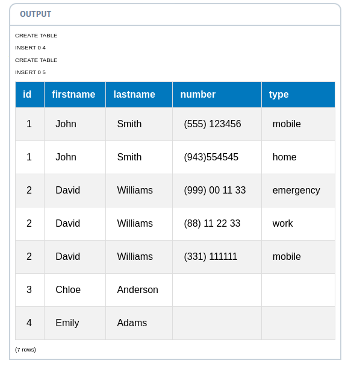
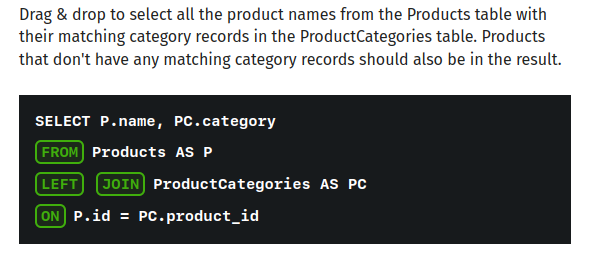
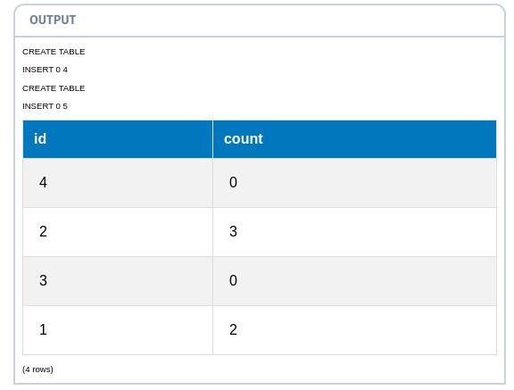
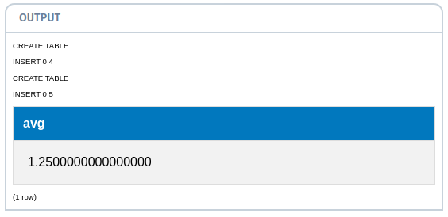

## Find the Average 
In this lesson we will learn how to solve a slightly more complex problem - we need to find the average number of phone numbers the Customers in our table have.

1. Here is the data of our Customers and PhoneNumbers tables:

```sql
SELECT * FROM Customers;

SELECT * FROM PhoneNumbers;  
```




2. To calculate the average, we need to find the number of phone numbers that each customer has, then use the AVG function over that result set.

First, let's join the tables:
```sql
SELECT C.id, C.firstname, C.lastname, PN.number, PN.type 
FROM Customers AS C LEFT JOIN PhoneNumbers AS PN 
ON C.id = PN.customer_id
ORDER BY C.id
```


We used a LEFT JOIN as not all customers have a phone number.
This is an important point: By simply joining the tables we would get the wrong result for the average.




3. Now we can group the data based on our customers and find the number of phone numbers each of them has:


```sql
SELECT C.id, COUNT(PN.number) AS count
FROM Customers AS C LEFT JOIN PhoneNumbers AS PN
ON C.id = PN.customer_id
GROUP BY C.id

```


Our custom 'count' column now has the number of phone numbers for each customer, as we grouped the query by the customer id.

As you can see from the results, the count also includes 0 values: that's because we used a LEFT JOIN and some of the customers don't have any matching phone numbers.

If we used JOIN instead of LEFT JOIN, we would get:

the customers that don't have any numbers
the customers that have matching numbers -- answer
all the customers in our table

4. Now, we need to find the average of these values. 
For that, we need another SELECT query over the data of the join:

```sql
SELECT AVG(count) FROM 
(SELECT C.id, COUNT(PN.number) AS count
FROM Customers AS C LEFT JOIN PhoneNumbers AS PN
ON C.id = PN.customer_id
GROUP BY C.id) AS Numbers
```



We aliased the query as 'Numbers' and selected the average value of the count column from it.

By enclosing a SELECT query in parentheses, we are able to give it a name and use it just like a table.

It is also important to give the custom columns name aliases, so you can select them.

To treat a SELECT statement as a table and give it a name, we need to enclose it in:

a group by clause
an aggregate function
parentheses -- answer
quotes

## Lesson Takeaways 
You learned how to solve a real-life problem!

The key takeaway from this lesson is that you are able to enclose a query into parentheses and give it a name using the AS keyword. This enables us to use the query as a table: select from it, use it in JOINS, run aggregate functions, etc.

Congratulations! You have completed the last lesson of this course.