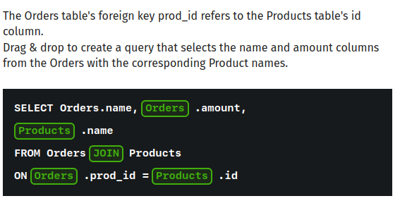
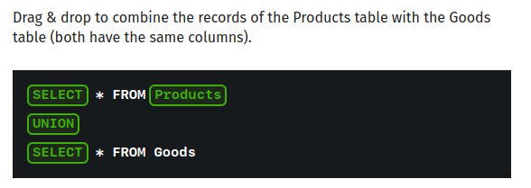

Module 3 Quiz


1. 

2. Which of the following removes duplicate records when combining tables?

CASE
UNION -- answer
ORDER BY
UNION ALL

3. The table Users contains 5 records, while the Accounts table is empty. The Accounts table refers to the Users table using a foreign key.

How many rows will be in the result of Users RIGHT JOIN Account ON the linked columns?

1
5
0 -- answer

4. 
5. Table A contains 5 rows, while table B contains 3 rows.

How many rows will the following query result?

```sql
SELECT * FROM A, B;
```
8
15 -- answer
5
3